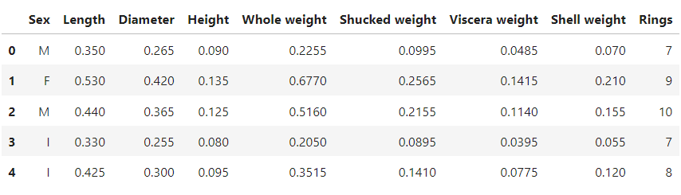
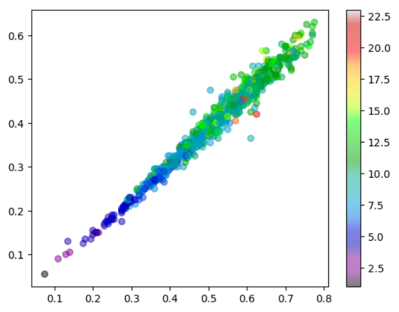

# MachineLearning_4
Knn

### ----------iris data set--------------

## Calculer la précision pour chaque K et les montrer avec Bar plot :

---
### -----------abalone data set-------------

## Montrer les values obtenues de 'y_test' avec scatter plot :

